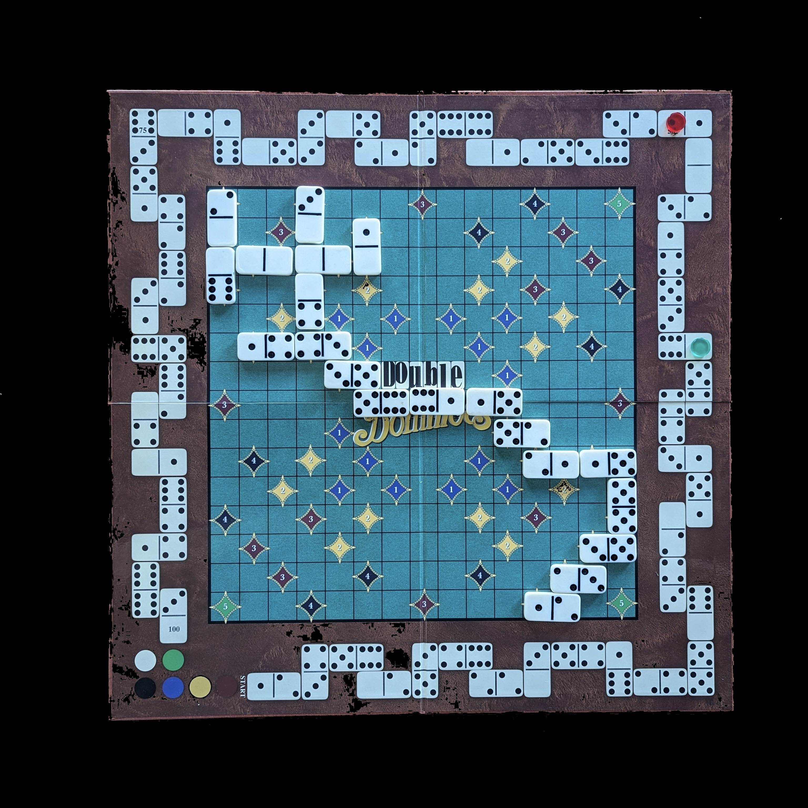
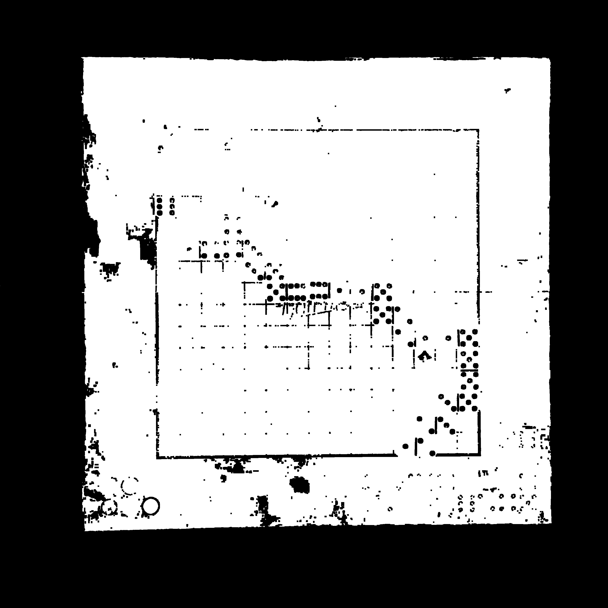
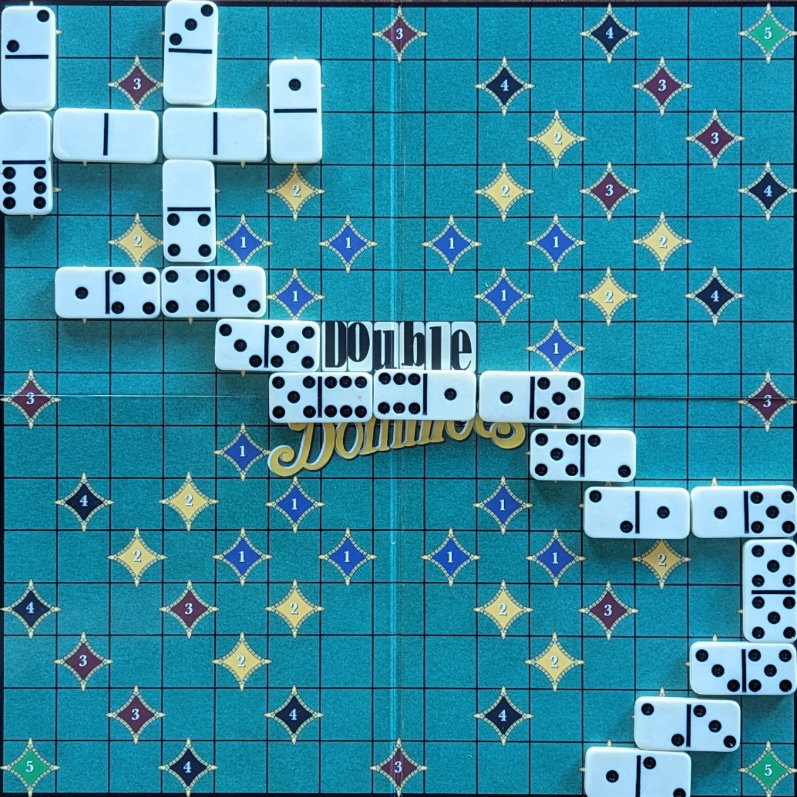
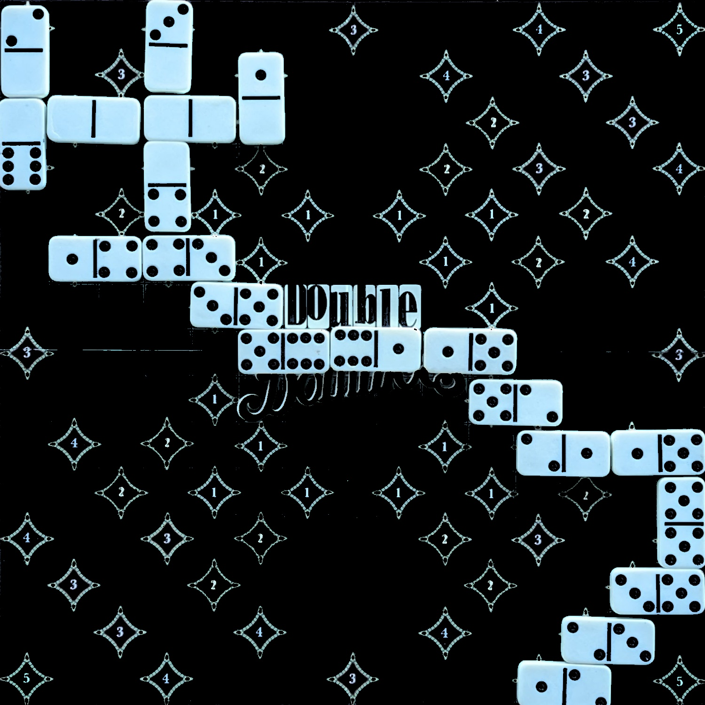
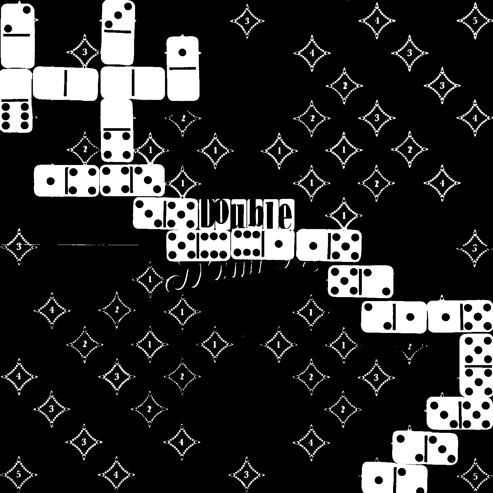
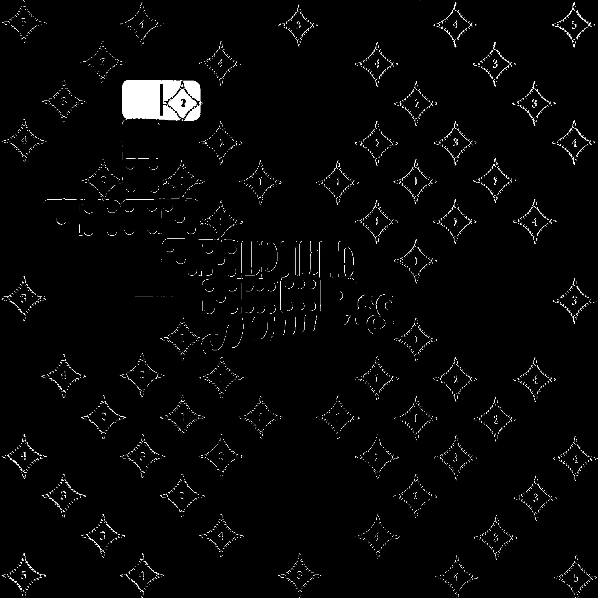
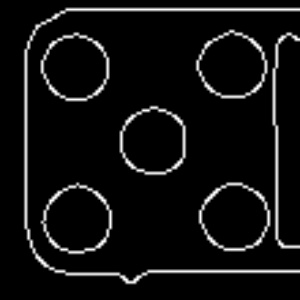
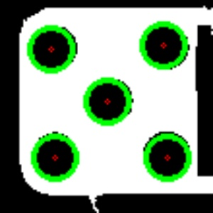

# Double Double Dominoes Automatic Score Keeper

This repository contains the documentation for a university project focused on computer vision techniques to detect and classify Double Double Dominoes game pieces from images taken at each step of the game. Using this detection, the algorithm can automatically compute the score for each player.

## Dataset
The dataset consists of images of the board game, captured from a fixed viewpoint using a tripod. Each image is taken immediately after a new piece has been added to the board.

## Detecting Piece Position
The core idea for detecting a newly placed piece is identifying the region with the most pixel differences compared to the previous image.

### Image Preprocessing
To focus on the relevant board area, the following steps are applied:
- An HSV mask is used to filter out the wooden table and board margins.
- Erosion is applied to remove residual white pixels.
- Thresholding is used to highlight the board while suppressing the background.
- Contour detection finds the board’s corners, enabling a perspective transform to extract the game area.

  
  
  

  <b>1).</b> HSV mask <b>2). </b>Thresholded image <b>3).</b> Perspective transform

### Position Detection
- The processed image is resized to 1500x1500 pixels, aligning with the 15x15 game grid.
- Another HSV mask and thresholding step highlight the domino pieces.
- The absolute difference between the current and previous images is computed.
- The algorithm scans the grid to find the two squares with the highest difference sum, identifying the newly placed piece.

  
  
  

  <b>1).</b> Second HSV mask <b>2).</b> Thresholded image <b>3).</b> Difference matrix

## Detecting Piece Type
Each domino piece contains two numbers represented by dots (similar to dice). The algorithm determines these numbers by detecting circular shapes in each half of the piece.

### Steps:
- The processed binary image undergoes median filtering to smooth edges.
- Canny edge detection and Hough Circle Transform are applied to detect circles.
- Experimentally tuned parameters ensure accurate detection while filtering out noise.

  
  
  

  <b>1).</b> Square section <b>2).</b> Canny edge detector <b>3).</b> Found circles with HoughCircles

## Computing the Score
With both the position and type of each piece determined, the algorithm automatically updates the score using a text file that tracks the current player.

---
### Future Improvements
- Expanding the dataset for improved generalization.
- Optimizing circle detection for better accuracy.
- Implementing a real-time video-based detection system.

